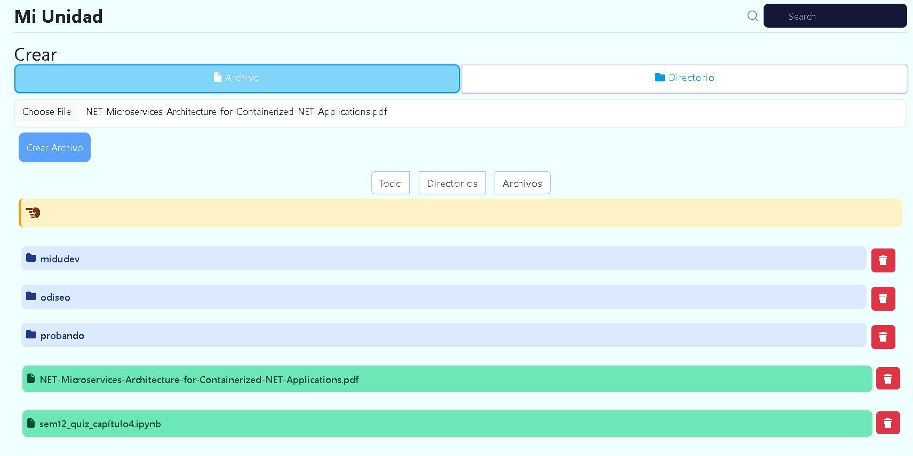

# Proyecto MiniDrive

¡Bienvenido al Proyecto MiniDrive!

Este proyecto es una pequeña imitación de Google Drive desarrollada utilizando React y .NET. MiniDrive proporciona una plataforma básica para almacenar y organizar archivos y carpetas en un entorno similar al de Google Drive.

## Funcionalidades

- **Agregar Carpetas y Archivos:** Puedes crear nuevas carpetas y subir archivos a tu MiniDrive.
- **Navegar entre Carpetas:** Explora tus archivos y carpetas de forma intuitiva, con una navegación similar a la de Google Drive.
- **Eliminar Carpetas y Archivos:** Elimina archivos y carpetas que ya no necesites.
- **Filtro y Buscador:** Utiliza funciones de filtro y búsqueda para encontrar rápidamente tus archivos.

## Captura de Pantalla

<!-- Aquí puedes insertar una captura de pantalla de tu proyecto -->
.

## Instalación

1. Clona este repositorio en tu máquina local.
2. Instala las dependencias necesarias para el frontend y el backend.
3. Ejecuta el servidor backend.
4. Ejecuta la aplicación frontend.

## Uso

1. Abre MiniDrive en tu navegador web.
2. Regístrate o inicia sesión con tu cuenta.
3. Comienza a cargar archivos y organizarlos en carpetas.
4. Explora las diferentes funcionalidades disponibles.

## Contribuciones

¡Las contribuciones son bienvenidas! Si quieres mejorar este proyecto, no dudes en abrir un pull request.

